# Отчёт по проектированию и анализу базы данных в MongoDB

## Задание 1.1: Анализ исходных данных и проектирование схемы

**Цель:** Изучить структуру данных и спроектировать эффективную схему для MongoDB.

**Исходные данные:** Файл в формате Parquet, каждая строка — один товар с привязкой к категории через поле `Category_FullPathName` (формат: `"Уровень1\Уровень2\Уровень3…"`).

**Короткая аналитическая справка:**

Данные содержат информацию о товарах одного маркетплейса (`_ozon`). Всего в наборе:
- 5261 уникальная категория с максимальной глубиной вложенности 8.
- 1 355 049 уникальных товаров (предложений), каждый с уникальным `Offer_ID`.
- 12 379 уникальных типов товаров (`Offer_Type`).
- Категория с наибольшим количеством товаров содержит 300 товаров. Таких категорий 4246.

**Обоснование разделения на две коллекции:**

Данные разделены на коллекции `categories` и `products` для оптимизации работы:
- **Категории** — справочная иерархическая структура с редкими изменениями, но частыми запросами по дереву.
- **Товары** — высокообъёмные данные, часто запрашиваемые для чтения.

Хранение в одной коллекции привело бы к дублированию иерархии, увеличению размера и сложности обновлений. Разделение позволяет:
- Использовать паттерн Materialized Path для категорий.
- Применять денормализацию для товаров, встраивая данные о категории, что ускоряет чтение.

**Преимущества денормализации:**
- Отсутствие дорогих операций `$lookup` (JOIN) при чтении.
- Ускорение типовых сценариев запросов (фильтрация по категории, типу).
- Простое индексирование денормализованных полей.
- Линейная масштабируемость коллекции товаров.
- Независимое обновление товаров и категорий.
- Упрощение аналитических запросов.
- Соответствие принципу MongoDB «храните данные так, как запрашиваете».

---

## Задание 1.2: Создание коллекции категорий (categories)

**Цель:** Преобразовать плоскую таблицу в иерархические документы с использованием паттерна **Materialized Path**.

**Структура документа:**
```javascript
{
  _id: "partner_categoryid",
  partner: String,
  category_id: String,
  name: String,
  path: String,
  path_array: Array,
  level: Number,
  parent_path: String,
  metadata: {
    total_products: Number,
    last_updated: ISODate
  }
}
```

**Результат:**
- Создана коллекция `categories` в базе `ecom_catalog`.
- Всего категорий: **5261**.
- Распределение по уровням:

| Уровень | Кол-во категорий |
|---------|------------------|
| 1       | 2                |
| 2       | 85               |
| 3       | 1491             |
| 4       | 3232             |
| 5       | 304              |
| 6       | 131              |
| 7       | 12               |
| 8       | 4                |


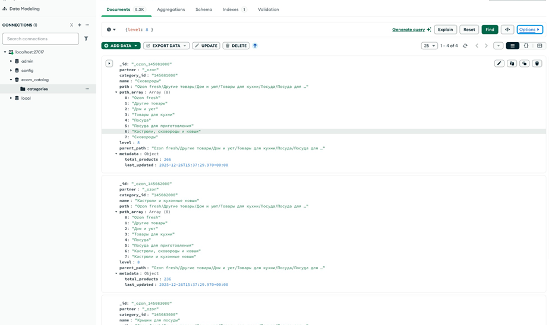
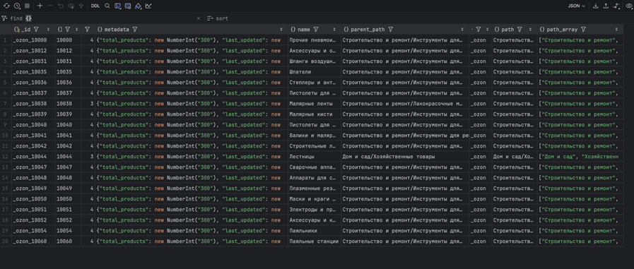

---

## Задание 1.3: Создание коллекции товаров (products)

**Цель:** Создать коллекцию товаров с встроенной информацией о категориях (денормализация).

**Структура документа:**
```javascript
{
  _id: "partner_offerid",
  partner: String,
  offer_id: String,
  name: String,
  type: String,
  category: {
    id: String,
    name: String,
    full_path: String,
    breadcrumbs: [
      { level: Number, name: String }
    ]
  },
  created_at: ISODate,
  updated_at: ISODate
}
```

**Результат:**
- Создана коллекция `products`.
- Всего товаров: **1 355 049**.
- **Топ-5 типов товаров:**
  1. Лекарственное средство безрецептурное — 10 167
  2. Печатная книга — 9 657
  3. Лекарственное средство рецептурное — 8 528
  4. Электронная книга — 3 382
  5. Сумка — 3 106

- Все товары принадлежат партнеру `_ozon` 1355049.

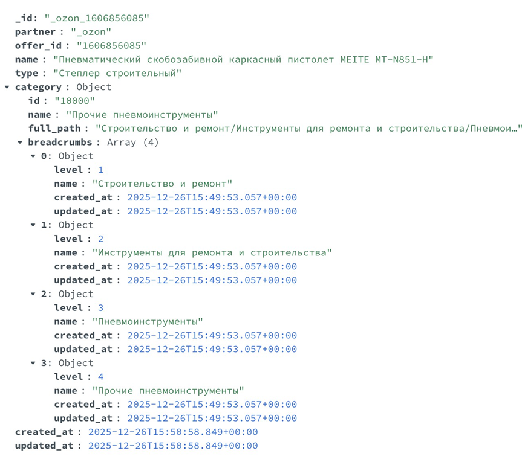
---

## Задание 1.4: Создание индексов для оптимизации запросов

**Индексы для `categories`:**
1. Текстовый индекс на `path` — для полнотекстового поиска.
2. Индекс на `path_array` — для поиска подкатегорий.
3. Составной индекс на `partner` и `level`.
4. Индекс на `metadata.total_products` — для сортировки по популярности.

**Индексы для `products`:**
1. Составной индекс на `partner` и `category.id`.
2. Индекс на `category.breadcrumbs.name`.
3. Составной индекс на `type` и `partner`.
4. Индекс на `offer_id`.

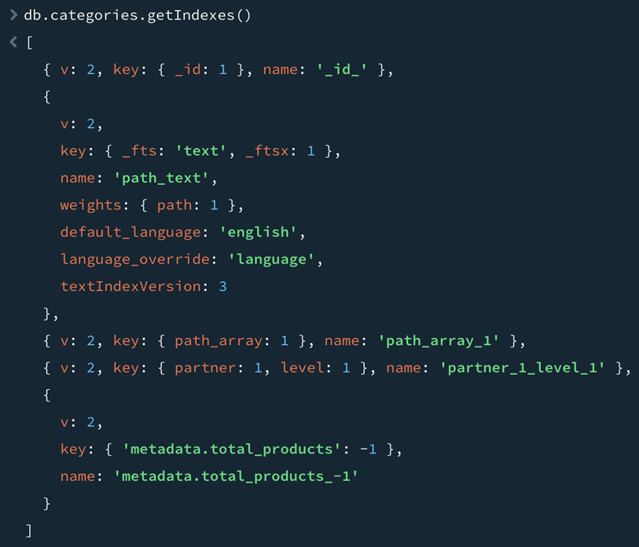
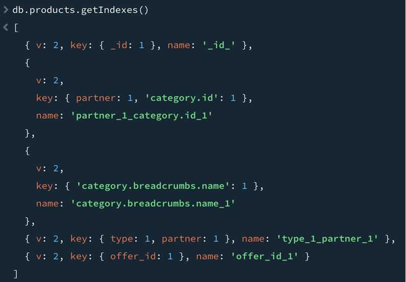

**Количество документов:** 5 261
**Статистика по индексам:**
- **categories**: данные ~3.3 МБ, индексы ~1.12 МБ (**~35%** от данных).
- **products**: данные ~1.24 ГБ, индексы ~92.5 МБ (**~7.5%** от данных).

| Поле / состав | Тип индекса | Размер (B) |
|----------------|-------------|------------|
| `_id_` | PK | 98 304 |
| `path` | text | 663 551 |
| `path_array` | 1 (ascending) | 319 498 |
| `partner, level` | 1,1 (составной) | 49 152 |
| `metadata.total_products` | -1 (descending) | 45 058 |

---

## Задание 2.1: Навигация по иерархии категорий

**Запрос 1:** Найти все корневые категории (`level = 1`) для `_ozon`.
- **Результат:** 2 категории ("Музыка и видео", "Книги").
- **Использован индекс:** `partner_1_level_1`.

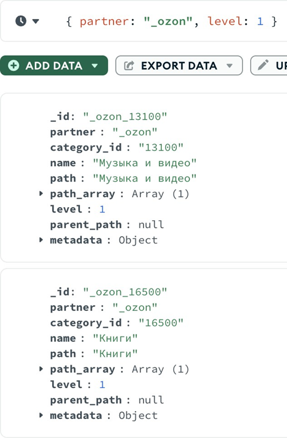

**Запрос 2:** Найти все подкатегории внутри "Строительство и ремонт".
- **Результат:** 540 категорий.
- **Использован индекс:** `path_array_1`.

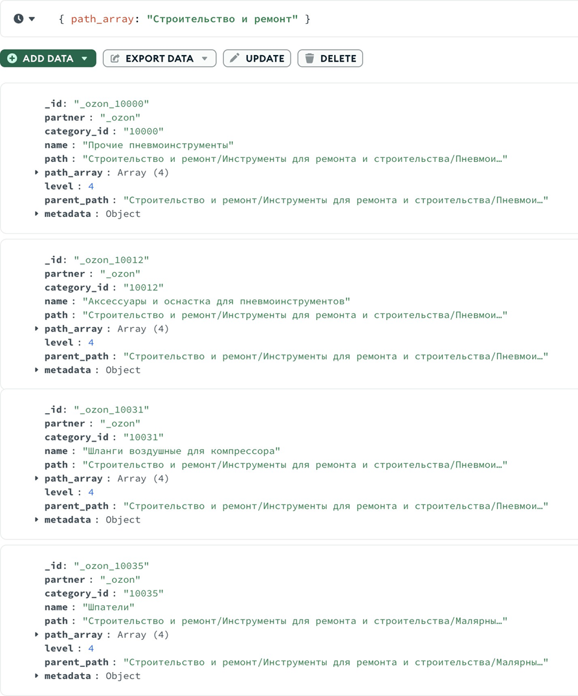

**Запрос 3:** Топ-10 категорий по количеству товаров.
- **Результат:** 5261 категория, топ — категории с 300 товаров.
- **Использован индекс:** `metadata.total_products_-1`.

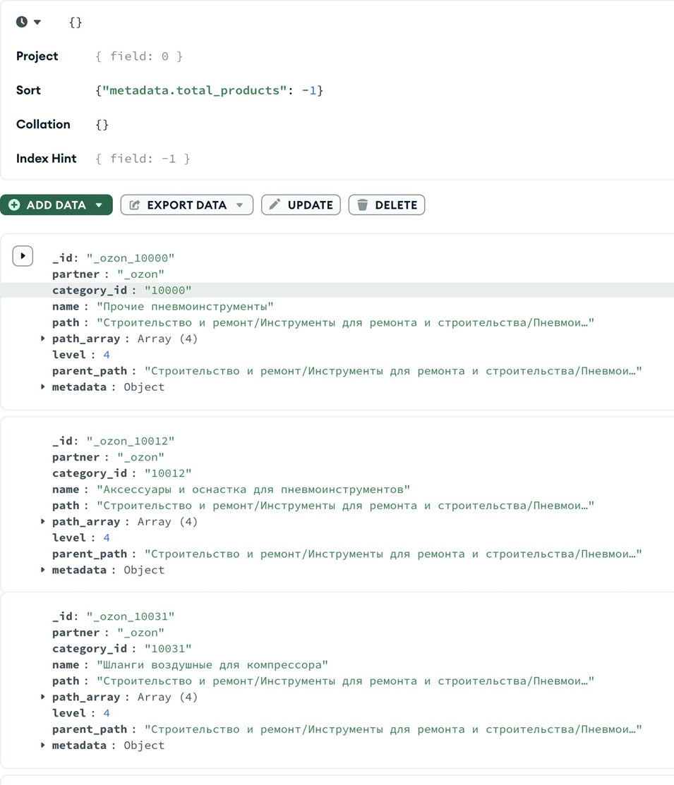

---

## Задание 2.2: Работа с товарами и вложенными документами

**Запрос 1:** Товары типа "Степлер строительный" с категорией "Пневмоинструменты".  
- **Результат:** 47 товаров.

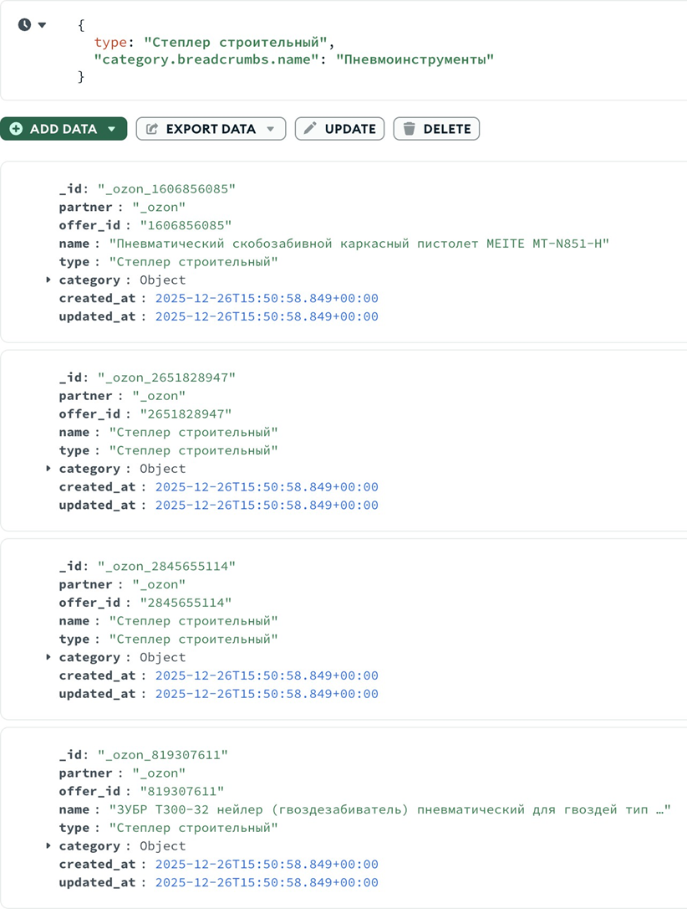

**Запрос 2:** Товары, находящиеся на 4-м уровне иерархии.  
- **Результат:** 915 661 товар.

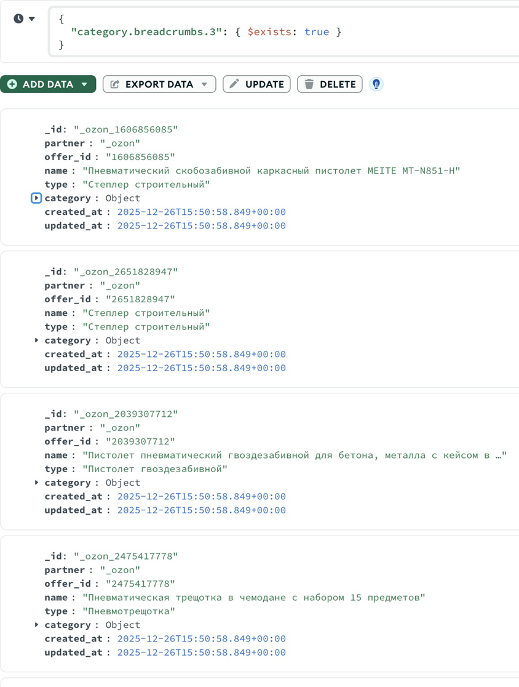

**Запрос 3:** Распределение товаров по корневым категориям.  
- **Результат:** Лидер — "Строительство и ремонт" (158 566 товаров).

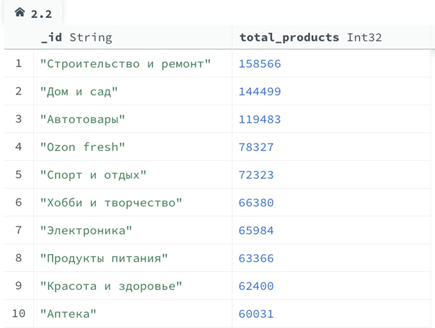

---

## Задание 3.1: Аналитика по категориям

**Агрегация 1:** Топ-10 категорий по количеству товаров.  
- **Результат:** Максимум товаров в одной категории — 300. Таких категорий 4246.
- **Время выполнения:** 3523 мс.

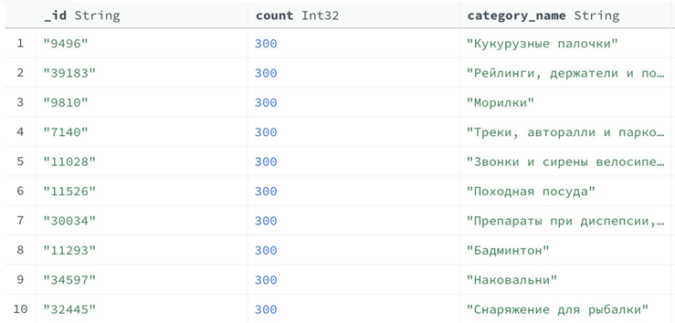

**Агрегация 2:** Иерархическая статистика по уровням.  
**Результат:** 
- На 1-м уровне больше всего товаров. Топ-3: "Строительство и ремонт", "Дом и сад", "Автотовары".
- На 2-м уровне: "Запчасти для легковых автомобилей", "Инструменты для ремонта и строительства", "Дача и сад"
- На 3-м уровне: "Бытовая техника", "Аксессуары и материалы для рукоделия", "Садовый инструмент"

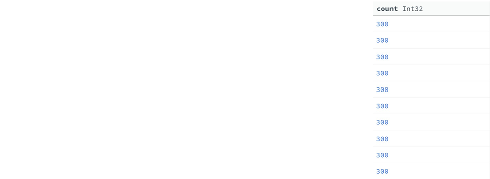
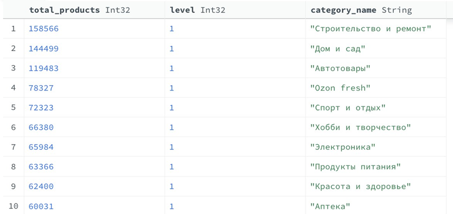
---

## Задание 3.3: Анализ структуры категорий

**Агрегация A:** Распределение категорий по уровням и партнерам.  
- **Результат:** Основная масса категорий на уровнях 3 и 4. Общее количество товаров растет с глубиной.
```
[
    {
        $group: {
            _id: {
                partner: "$partner", level: "$level"
            },
            categories_count: { $sum: 1 }, total_products: {
                $sum: "$metadata.total_products"
            }
        }
    },
    {
        $project: {
            _id: 0,
            partner: "$_id.partner", level: "$_id.level",
            categories_count: 1,
            total_products: 1
        }
    },
    {
        $sort: {
            partner: 1,
            level: 1
        }
    }
]
```

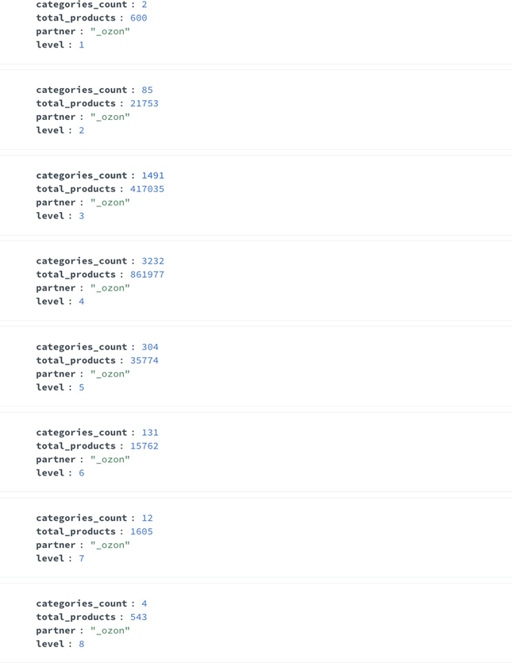
**Агрегация Б:** Поиск категорий-листьев (без подкатегорий).  
- **Результат:** Топ-10 листьев содержат по 300 товаров. Это потенциальные кандидаты для дальнейшего разбиения.
```
[
    {
        $lookup: {
            from: "categories", localField: "path", foreignField: "parent_path", as: "children"
        }
    },
    {
        $match: {
            children: { $eq: [] }
        }
    },
    {
        $project: {
            _id: 0,
            partner: 1,
            category_id: 1,
            name: 1,
            path: 1,
            level: 1,
            total_products: "$metadata.total_products"
        }
    },
    {
        $sort: {
            total_products: -1
        }
    },
    {
    $limit: 10
    }
]
```

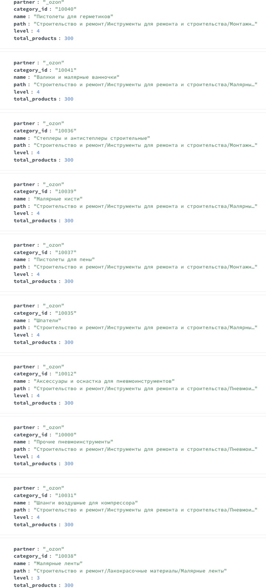

**Вывод:** Средняя глубина категорий смещена к уровням 3–4. Категории-листья с максимальным заполнением (300 товаров) указывают на возможную перегруппировку для улучшения навигации.